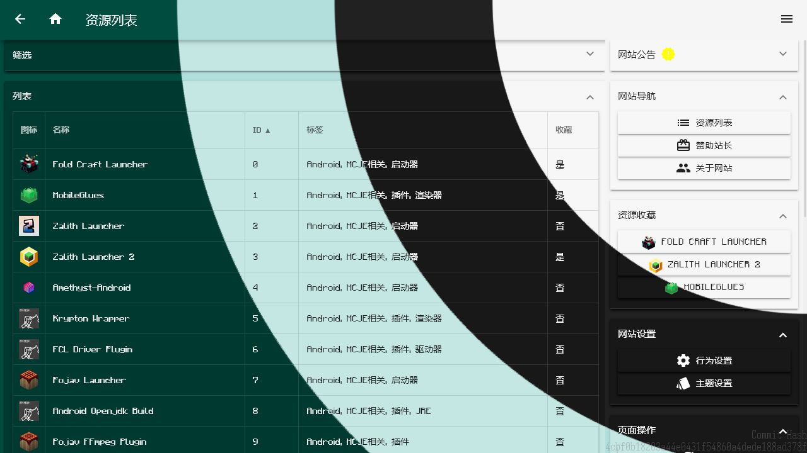

# XiaoluoFoxington/FCL.downsite.NEW

## 项目简介



[《Fold Craft Launcher》](https://github.com/FCL-Team/FoldCraftLauncher)（以下简称"FCL"）非官方公益下载站，由玩家社群自发搭建。

除了 FCL，此站还收录了诸多启动器、渲染器、插件、JRE 等资源，旨在帮助玩家在 Android 设备上更便捷地游玩《Minecraft: Java Edition》。如你所见，这是一个纯静态网站，无需后端，可部署在任何静态文件服务器上。

把名字改一下，可以完全拿来当软件资源站模板用[doge]。

这是下载站的第 4 次重制。旧版本存档如下，不再维护：

- 第 3 次重制：[XiaoluoFoxington/FCL.website.NEXT](https://github.com/XiaoluoFoxington/FCL.website.NEXT)
- 第 2 次重制：[XiaoluoFoxington/FCL.website.mdui](https://github.com/XiaoluoFoxington/FCL.website.mdui)
- 第 1 次重制：[fcl-docs/FCL.website](https://github.com/fcl-docs/FCL.website)

## 站点特色

- 烂大街的 MDUI，但是是 MD1。那 MD3 是真丑吧，大圆角、没阴影，反正我是不喜欢。
- 能跑就行的 JS，不报错就算成功，还有 AI 随机拉大便。
- 随意命名的函数和变量，自己都看不懂。
- 不务正业地塞彩蛋，正事反而往后排。
- 无任何框架，纯原生 HTML/CSS/JS，返璞归真。

## 技术栈

| 层面 | 选型 |
| --- | --- |
| 样式 | MDUI 1.0.2 + 自制主题增强 + 补丁 |
| 脚本 | 原生 JavaScript（ES Module） |
| 构建 | 无（纯静态，所见即所得） |
| 部署 | 任意静态文件服务器 |

## 国际化（i18n）

- 支持简体中文（默认）与 English，入口在右侧抽屉的“网站设置”→“语言设置”独立页面（`html/language.html`）。
- 语言设置页以可排序列表管理语言顺序：第一位为界面显示语言，其余语言在翻译缺失时按列表顺序依次回退；顺序保存在本地偏好（`fdn-language-order`，兼容旧版 `fdn-language`）。
- 文案集中维护在 `js/i18n/zh-CN.js` 与 `js/i18n/en-US.js`；静态页面通过 `data-i18n` 属性标记，动态文案通过 `t()` 函数获取。
- 翻译键缺失时自动回退到另一种语言，再回退到键本身，任何异常都不会影响页面可用性。
- 数据源内容翻译约定：
  - 短文本（设置项、标签、线路名、详情页消息、贡献者与开源项目描述等）统一放在语言包中，按稳定 ID/序号寻址（如 `mirror.0`、`detailMessage.10.0`）；
  - 长文档（公告、软件介绍页）按语言后缀存放文件（如 `announcement.en-US.html`、`intro.en-US.html`），加载时优先当前语言，缺失时回退中文原文件；
  - 数据源本身保持单一语言不变，未收录的键自动回退原文。

## 项目结构

```
data/
  software.json          -- 软件基础数据源（ID、名称、图标、标签、详情路径）
  tag.json               -- 标签定义
  mirror.json            -- 下载线路配置
  setting.json           -- 站点设置项定义
  feedback.json          -- 反馈渠道
  verInfo.json           -- 版本标识（Git Hash）
  software/{id}/         -- 各软件详情页数据（detail.json、intro.html 等）
  down/{id}/             -- 各版本下载数据
  mirror/{id}/           -- 本地镜像数据
html/                    -- 页面模板
  index.html             -- 首页
  list.html              -- 资源列表页
  detail.html            -- 软件详情页
  down.html              -- 下载页
  intro.html             -- 介绍页（内嵌渲染）
  about.html             -- 关于页
  sponsor.html           -- 赞助页
  behavior.html          -- 行为设置页
css/                     -- 样式文件
  mdui.theme.enhanced.css-- 自制主题增强样式
  mdui.patch.css         -- 补丁样式
  xf.css                 -- 网站自定义样式
js/                      -- 脚本目录
  adapters/download/     -- 下载数据适配器，每种镜像站数据结构对应一个文件
  common/                -- 通用功能（抽屉菜单、主题、无障碍、赞助提醒、公告等）
  controllers/           -- 页面状态管理
  domain/                -- 领域模型（书签、偏好设置、系统信息、主题、站点信息）
  http/                  -- HTTP 请求封装（超时、取消、错误处理、页面缓存）
  repositories/          -- 数据获取层（此站数据、镜像数据）
  security/              -- 安全策略（内容安全策略）
  views/                 -- DOM 渲染层
  *.js                   -- 各页面入口文件
media/                   -- 静态资源（图片、缩略图等）
```

## 架构说明

代码采用分层思路，虽然写得很随意，但好歹有个架子：

- **`repositories/`** 负责从网络或本地获取数据，返回原始数据。
- **`controllers/`** 负责处理业务逻辑，管理页面状态。
- **`views/`** 只负责往 DOM 里塞东西，不干别的。
- **`http/client.js`** 统一处理请求、超时、取消、错误和页面内缓存。
- **`adapters/download/`** 每个文件只适配一种下载源的数据结构，最终统一输出 `name`、`version`、`architecture`、`size`、`description`、`downloadUrl`、`available` 和 `source`。

## 收录资源

此站收录的软件涵盖以下类型（详见 [tag.json](data/tag.json)）：

- 启动器（Fold Craft Launcher、Zalith Launcher、Pojav Launcher、HMCL-PE 等）
- 渲染器插件（MobileGlues、Krypton Wrapper 等）
- 驱动插件（FCL Driver Plugin 等）
- JRE 构建（Android Openjdk Build 等）
- 工具（EnchantNet 等）
- 跨平台（Windows、Linux 等）

## 新增下载线路

1. 若新线路使用**已有数据结构**，只需在 `data/mirror.json` 添加镜像条目，并在对应软件详情的 `download` 字段中引用。
2. 若数据结构不同，在 `js/adapters/download/` 下新增一个纯函数适配器文件，然后在 `index.js` 的注册表中登记对应的 `apiVer`。
3. 适配器仅做数据转换，不得发起网络请求或操作 DOM。额外接口请求放在 repository 中，页面交互和取消逻辑放在 controller 中。

## 开发与贡献

- 此站是静态站点，无需构建工具，修改后直接刷新浏览器即可。
- 提交 PR 前请确保代码风格一致（虽然本来也没什么风格可言）。
- 若发现 Bug 或有功能建议，欢迎提交 [Issue](https://github.com/XiaoluoFoxington/FCL.downsite.NEW/issues/new) 或通过 [腾讯问卷](https://wj.qq.com/s2/27273825/b7f1/) 反馈。

## 免责声明

此站并非 Minecraft 官方网站，亦非任何启动器的官方网站。此站与 Mojang、微软及各启动器开发者均无隶属关系。此站仅为公益性质的资源整合与分享站点，旨在为普通玩家提供便捷的下载服务。
